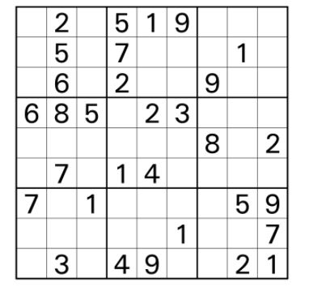
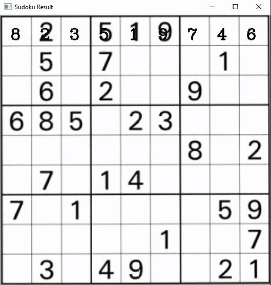

## SudokuBot
Solving Sudoku puzzles with Image Processing and Machine Learning

## Motivation 
This project was created for purposes of learning image processing using OpenCV framework and learning how to create & use a convolutional neural network. 
This project aims to solve any given 9x9 sudoku puzzle and return user the solution for the given puzzle grid.

## Current status
This project is still under development.

## Tech/Framework Used
<h3>Backend:</h3>
Image Processing: OpenCV (https://opencv.org/)  
CNN: Tensorflow (https://www.tensorflow.org/)  
Solving Sudoku: py-sudoku (https://pypi.org/project/py-sudoku/)  
Web Framework: Flask (https://flask.palletsprojects.com/en/1.1.x/)  

<h3>Frontend:</h3>
Frontend Framework: AngularJS (https://angular.io/)

## Example
Input:  

Output:  

## Credits
CNN architecture used in this project was inspired by: https://engmrk.com/lenet-5-a-classic-cnn-architecture/
